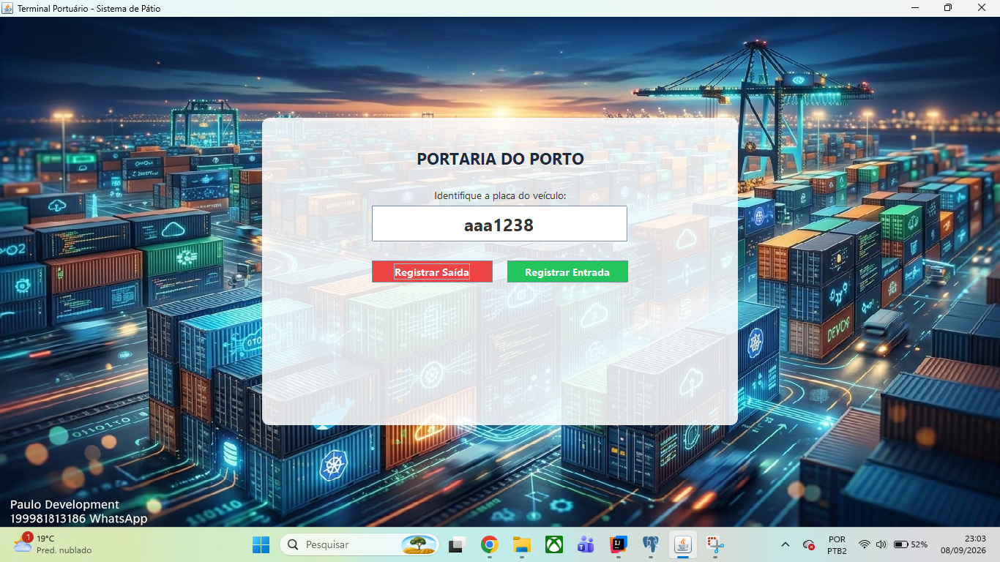

# Sistema de Controle de Pátio - Terminal Portuário

Este é um sistema desktop nativo desenvolvido em Java para o gerenciamento logístico de veículos em um pátio portuário. O software automatiza o controle de entrada e saída da portaria, contando com persistência de dados em banco PostgreSQL, interface gráfica customizada com transparência e sincronização de tempo com o Horário Oficial de Brasília por meio de uma API externa.
VOU COLOCAR ALGUNS PRINTS E UM VIDEO NO FINAL PARA MOSTRAR FUNCIONALIDADE. QUEM QUISER PODE USAR ESTE PROGRAMA NA SUA EMPRESA NÃO VOU COBRAR, SE TE AJUDAR E QUISER ME RETRIBUIR O PIX É 19981813186 MEU ZAP TAMBEM :)

## Funcionalidades Principais

* **Portaria Simplificada:** Interface projetada para a operação ágil do pátio. O operador precisa apenas digitar a placa do veículo para realizar as movimentações.
* **Fluxo de Cadastro Automático:** Se uma placa nova que acabou de desembarcar do navio for inserida, o sistema inicia uma rotina interativa para coletar o tipo (Carro ou Moto), modelo e cor do veículo.
* **Transição de Interfaces:** Alternância automática entre a tela de digitação inicial e a tabela de confirmação de dados do veículo.
* **Sincronização de Tempo:** Integração com API web para carimbar a data e hora exatas de cada movimentação com base no fuso horário de Brasília. O código inclui um mecanismo de contingência que utiliza o relógio local caso o estabelecimento perca a conexão com a internet.
* **Travas de Segurança Lógica:** Validações de negócio estruturadas diretamente no código para impedir que um veículo receba duas autorizações de saída consecutivas ou reentradas quando já estiver no pátio.

## Conceitos de Programação Orientada a Objetos (POO)

A arquitetura do software foi dividida para demonstrar a aplicação prática dos fundamentos de POO:

1. **Herança:** A classe genérica Veiculo centraliza as propriedades comuns do pátio, servindo como base para as classes especialistas Carro e Moto.
2. **Encapsulamento:** Os atributos sensíveis utilizam os modificadores de acesso protected e private, sendo manipulados externamente apenas por métodos Getters e Setters específicos.
3. **Polimorfismo:** A classe Patio gerencia listas e execuções usando o tipo genérico da classe mãe, aceitando os objetos das classes filhas de forma dinâmica.

## Tecnologias e Dependências

* **Linguagem:** Java 17 ou superior
* **Interface Gráfica:** Java Swing e AWT
* **Banco de Dados:** PostgreSQL (com conexão JDBC)
* **API de Tempo:** World Time API (Fuso horário America/Sao_Paulo)

## Estrutura da Tabela no Banco de Dados

Para preparar o seu banco de dados no pgAdmin antes de rodar o sistema pela primeira vez, execute o script SQL abaixo:

```sql
CREATE TABLE veiculos (
    id SERIAL PRIMARY KEY,
    tipo VARCHAR(10) NOT NULL,
    modelo VARCHAR(50) NOT NULL,
    placa VARCHAR(20) NOT NULL UNIQUE,
    cor VARCHAR(20) NOT NULL,
    no_patio BOOLEAN NOT NULL,
    ultima_movimentacao TIMESTAMP WITH TIME ZONE
);
```

## Como Configurar e Rodar

1. Certifique-se de ter o Java JDK instalado em seu ambiente de desenvolvimento.
2. Configure o serviço local do PostgreSQL com as mesmas credenciais informadas na classe Patio.java.
3. Adicione o driver JDBC do PostgreSQL às dependências ou bibliotecas do seu projeto.
4. Coloque a imagem que servirá de plano de fundo com o nome containers.jpg dentro do diretório src do seu projeto.
5. Execute a classe Main.java para abrir a interface gráfica.
7. 

https://github.com/user-attachments/assets/6bddccbd-143a-479a-b030-be306665b933


8. 
